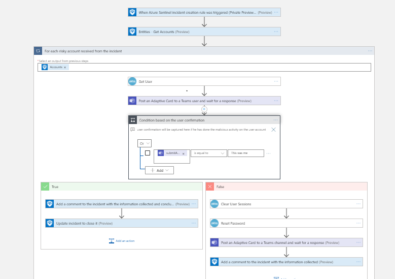
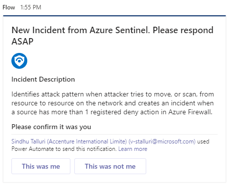

# Okta-Prompt User Playbook
 ## Summary

When a new Azure Sentinel incident is created, this playbook gets triggered and performs below actions:
1. An adaptive card is sent to the risky user asking if they have done the malicious activity
2. If user confirms yes, the incident will be closed  and enriched as a comment with the user details
3. Else, the **user sessions will be cleared** and **reset password link will be sent to user** 
4. An adaptive card is sent to the SOC Teams channel, providing information about the incident and risky user details. The SOC can investigate further on the user.

 

**This is the adaptive card user will recieve when playbook is triggered:**  
  

**This is the adaptive card SOC will recieve if user confirms they didn't to the malicious activity:**  
  

### Prerequisites 
1. Okta custom connector needs to be deployed prior to the deployment of this playbook under the same subscription.
2. Generate an API key.Refer this link [ how to generate the API Key](https://developer.okta.com/docs/guides/create-an-api-token/overview/)

### Deployment instructions 
1. Deploy the playbook by clicking on "Deploy to Azure" button. This will take you to deplyoing an ARM Template wizard.

2. Fill in the required paramteres:
    * Playbook Name : Enter the playbook name here (ex:OktaPlaybook)
    * Teams GroupId : Enter the Teams channel id to send the adaptive card
    * Teams ChannelId : Enter the Teams Group id to send the adaptive card
     [Refer the below link to get the channel id and group id](https://docs.microsoft.com/en-us/powershell/module/teams/get-teamchannel?view=teams-ps)

### Post-Deployment instructions 
#### a. Authorize connections
Once deployment is complete, you will need to authorize each connection.
1.	Click the Azure Sentinel connection resource
2.	Click edit API connection
3.	Click Authorize
4.	Sign in
5.	Click Save
6.	Repeat steps for other connections such as Teams connection and Okta Api  Connection (For authorizing the Okta API connection, the API Key needs to be provided)
#### b. Configurations in Sentinel
1. In Azure sentinel analytical rules should be configured to trigger an incident with risky user account 
2. Configure the automation rules to trigger this playbook

## Playbook steps explained
### When Azure Sentinel incident creation rule is triggered

Azure Sentinel incident is created. The playbook receives the incident as the input.
### Entities - Get Accounts

Get the list of risky/malicious accounts as entities from the Incident
### For each-risky account received from the incident
Iterates on the accounts found in this incident (probably one) and performs the following:
For the risky user account, playbook uses "Get User" action to get user details from Okta
#### Posts an Adaptive card to  user 
In this step we post a message in Microsoft Teams to the risky user with Incident details and ask for his confirmation on the malicious activity described in the incident.
#### If Condition based on the user confirmation
#### If the user confirms it was him:
  a. Incident is commented with all the  details below
   * User information collected by "Get User" action from Okta
     User id, User name, User login, User email, User status, User created, User activated, User statusChanged, User lastLogin, User lastUpdated, User passwordChanged
   * Actions taken on Sentinel 

  b. Close Incident
#### If the user confirms it was not him:
  a. Playbook uses "Clear User Sessions" action to clear the user sessions in Okta

  b. Playbook uses "Reset Password" action to resest the password of the user in Okta

  c. SOC user will be sent an adaptive card with the user details, Incident information to investigate further

  d. Add a comment to the incident with the following details:
  
  * User information collected by "Get User" action from Okta such as
     * User id, User name,User login,User email,User status,User created,User activated,User statusChanged, User lastLogin, User lastUpdated, User passwordChanged  

  * Actions taken on Okta: Cleared the user sessions and reset the password of the user.

  * Actions taken on Sentinel: Informed the SOC admin about the risky user and asked him to investigate further

